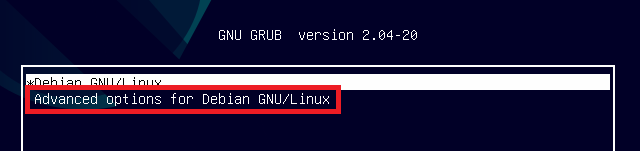
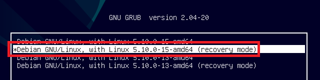
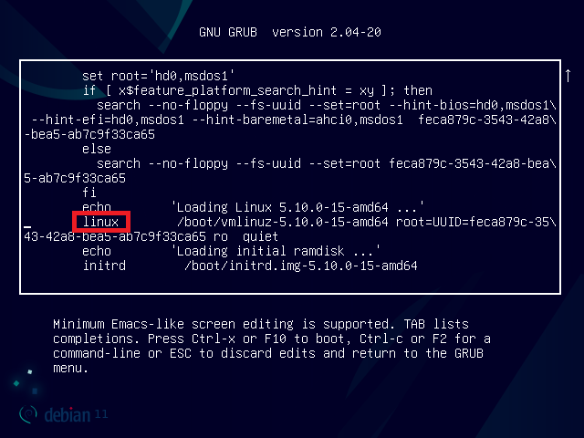

此问题目前在 H3C 部分机型有遇到，可能安装 Ubuntu 也会遇到这个问题

## 解决办法

两种方式任选一种均可

### 方式1：维护模式下修改

**注意：如果在系统安装过程中未设置 root 密码，维护模式将无法进入！会提示 "Cannot open access to console, the root account is locked." - “无法访问控制台，root 账户被锁定”。**

1. 重启系统，在启动菜单(`GNU GRUB`)界面选择 `Advanced options for Debian GNU/Linux`

 然后选择 `Debian GNU/Linux, with Linux 5.10.0-15-amd64 (recovery mode)`，后面的内核版本号可能不同

2. 在屏幕下方提示 `Give root password for maintenance` 后，输入 root 密码并回车进入维护模式的控制台界面
3. 修改 GRUB 文件
    1. 使用编辑器打开 grub 文件

        ```ShellSession
        root@debian:~# nano /etc/default/grub
        ```

    2. 找到如下一行内容

        ```text
        GRUB_CMDLINE_LINUX_DEFAULT="quiet"
        ```

        并修改为

        ```text
        GRUB_CMDLINE_LINUX_DEFAULT="quiet splash nomodeset"
        ```

    3. 按下组合键 `Ctrl` + `O` 并回车保存修改后的文件，按下组合键 `Ctrl` + `X` 退出编辑

    4. 返回到控制台界面后执行下列命令使修改生效

        ```ShellSession
        root@debian:~# export PATH=$PATH:/usr/sbin
        root@debian:~# update-grub
        ```

    待执行完成后，重启机器即可

### 方式2：GRUB 处修改

1. 重启系统，在启动菜单(`GNU GRUB`)界面光标移动到 `Debian GNU/Linux` 上并按下 `e` 键打开临时 GRUB 编辑界面
2. 光标移动到 `linux` 开头的一行，按下 `End` 键跳转到行尾

3. 添加 `splash nomodeset` 参数到行尾并按下组合键 `Ctrl` + `X` 以该参数**临时**启动到系统
修改后的截图，**注意参数之间的空格**

4. 进入桌面后按下 `Windows` 徽标键打开软件列表菜单，输入 `ter` 或者找到 `终端` 并打开
5. 输入命令 `su` 并输入 root 密码切换到 root 账号
6. 后续步骤均同 `方式 1` 下的 `第 3 步`

## 参数说明

前面所修改的参数均为 Linux 内核参数，内核参数有几百项之多，此处仅说明本文用到的几个，完整参数列表见参考链接

1. quiet
    禁止大多数日志消息

    > quiet [KNL] Disable most log messages

2. splash
    显示启动画面

    > This option is used to start an eye-candy "loading" screen while all the core parts of the system are loaded in the background.

3. nomodeset
    添加该参数指示内核在 X (server) 加载完成前不要加载显示(视频)驱动而是使用 BIOS 模式

    > Adding the nomodeset parameter instructs the kernel to not load video drivers and use BIOS modes instead until X is loaded.

根据描述，只有 `nomodeset` 是必须的，另外两个参数均可忽略 ~~，但尚未实机(H3C系列)测试~~

## 参考链接

1. [手动设置用于 Linux 引导的“nomodeset”内核引导行选项 | Dell 中国](https://www.dell.com/support/kbdoc/zh-cn/000123893/%E6%89%8B%E5%8A%A8-nomodeset-%E5%86%85%E6%A0%B8%E5%BC%95%E5%AF%BC-%E8%A1%8C%E9%80%89%E9%A1%B9-%E7%94%A8%E4%BA%8E-linux-%E5%BC%95%E5%AF%BC)
2. [boot - Why do I need to replace "quiet splash" with "nomodeset"? - Ask Ubuntu](https://askubuntu.com/questions/1024895/why-do-i-need-to-replace-quiet-splash-with-nomodeset)
3. [kernel-parameters.txt - Github](https://github.com/torvalds/linux/blob/master/Documentation/admin-guide/kernel-parameters.txt)
4. [When starting debian(GNOME) I just get a black screen, what is the problem and what can I do to fix it? : debian (reddit.com)](https://www.reddit.com/r/debian/comments/cl2ufd/when_starting_debiangnome_i_just_get_a_black/evsj2sr/)
5. [grub2 - How do I add a kernel boot parameter? - Ask Ubuntu](https://askubuntu.com/questions/19486/how-do-i-add-a-kernel-boot-parameter)
